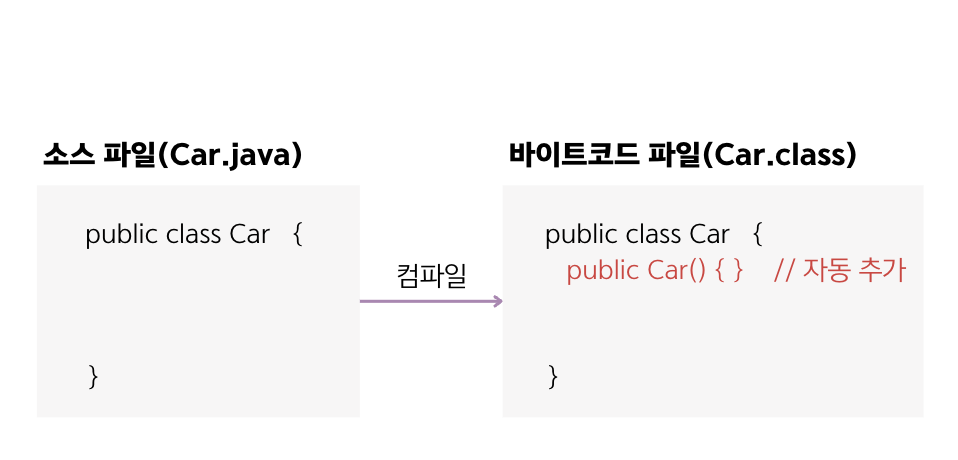

## 6.7 생성자 선언과 호출
- `new 연산자`는 **객체를 생성한 후 연이어 생성자를 호출**해서 **객체를 초기화**하는 역할을 함.
  - 💠 객체 초기화 : 필드 초기화를 하거나 메소드를 호출해서 객체를 사용할 준비를 하는 것
```java
클래수 변수 = new 클래스();     // '클래스()' 가 생성자를 호출하는 것.
```
- 생성자가 성공적으로 실행이 끝나면 new 연산자는 객체의 주소를 리턴함.
- 리턴된 주소는 클래스 변수에 대입되어 객체의 필드나 메소드에 접근할 때 이용됨.

### 기본 생성자
- 모든 클래스는 생성자가 존재하며, 하나 이상을 가질 수 있음.
- 클래스에 생성자 선언이 없으면 컴파일러는 아래와 같은 `기본 생성자`를 바이트코드 파일에 자동으로 추가시킴.
  ```java
  [public] 클래스() { }
  ```
- 클래스가 public 클래스로 선언되면 기본 생성자에도 public이 붙고, 클래스가 public 없이 class로만 선언되면 기본 생성자에도 public이 붙지 않음.
- 클래스를 설계할 때 생성자를 생략하면 기본생성자가 같이 생성되기 때문에 new 연산자 뒤에 기본 생성자를 호출할 수 있음.

- 개발자가 명시적으로 **선언한 생성자가 있다면 컴파일러는 기본 생성자를 추가하지 않음**.

### 생성자 선언
- 객체를 다양하게 초기화하기 위해 생성자를 다음과 같이 직접 선언할 수 있음.
```java
클래스(매개변수, ...) {
    // 객체의 초기화 코드
}
```
- 생성자는 메소드와 비슷한 모양을 가지고 있지만, 리턴 타입이 없고 클래스 이름과 동일.
- 매개변수는 new 연산자로 생성자를 호출할 때 매개값을 생성자 블록 내부로 전달하는 역할을 함.
  - ex) Car 생성자를 호출할 떄 3개의 매개값을 블록 내부로 전달하는 경우 아래와 같은 생성자가 선언되어야 함.
  ```java
  Car myCar = new Car("그랜저". "검정", 300);
  ```
  ```java
  public class Car {
    // 생성자 선언
    Car(String model, String color, int maxSpeed) {...}
  }
  ```

### 필드 초기화
- 객체마다 동일한 값을 가지고 있다면 필드 선언 시 초기값을 대입하는 것이 좋음.
- 객체마다 다른 값을 가져야 한다면 생성자에서 필드를 초기화하는 것이 좋음.
```java
public class Korean {
    // 필드 선언
    String nation = "대한민국";
    String name;
    String Ssn;
    
    // 생성자 선언
    public Korean(String n, String s) { // 매개변수 이름으로 n과 s를 사용하면 가독성 안 좋음.
        name = n;
        ssn = s;
    }
}
```
- 생성자의 매개값은 new 연산자로 생성자를 호출할 때 주어짐.
  - ex)
  ```java
  Korean k1 = new Korean("홍길동", "001122-1234567");
  ```
- 매개변수명이 필드명과 동일할 떄는 필드임을 구분하기 위해 `this 키워드`를 필드명 앞에 붙여줌.
  - this는 현재 객체를 말하며, this.name은 현재 객체의 데이터(필드)로서의 name을 말함.
  ```java
  public Korean(String name, String ssn) { // 매개변수명이 필드명과 동일.
      this.name = name;
      this.ssn = ssn;
  }
  ```

### 생성자 오버로딩
- 매개값으로 객체의 필드를 다양하게 초기화하려면 생성자 `⭐️오버로딩⭐️`이 필요함.
- 💠 생성자 오버로딩 : 매개변수를 달리하는 생성자를 여러 개 선언하는 것
- 매개변수의 타입과 개수 그리고 선언된 순서가 똑같은 경우 매개변수 이름만 바꾸는 것은 생성자 오버로딩❌
  ```java
  // 생성자 오버로딩이 아닌 경우
  Car(String model, String color) {}
  Car(String color, String model) {}    // 컴파일 에러 발생
  ```
- 생성자가 오버로딩되어 있을 경우, new 연산자로 호출할 때 제공되는 매개값의 타입과 수에 따라 실행될 생성자가 결정됨.
  ```java
  Car car1 = new Car();               ->  Car() {}
  Car car2 = new Car("그랜져");         ->   Car(String model) {}
  Car car3 = new Car("그랜져", "흰색");  ->   Car(String model, String color) {}
  ```

### 다른 생성자 호출
- 생성자 오버로딩이 많아질 경우 생성자 간의 중보된 코드가 발생할 수 있음.
- 이 경우에는 공통 코드를 한 생성자에만 집중적으로 작성하고, 나머지 생성자는 this()를 사용하여 공통 코드를 가지고 있는 생성자를 호출하는 방법으로 개선할 수 있음.
- this는 생성자의 첫 줄에 작성되며 다른 생성자를 호출하는 역할을 함. 호출하고 싶은 생성자의 매개변수에 맞게 매개값을 제공하면 됨.
```java
Car(String model) {
    this(model, "은색", 250);
}
```