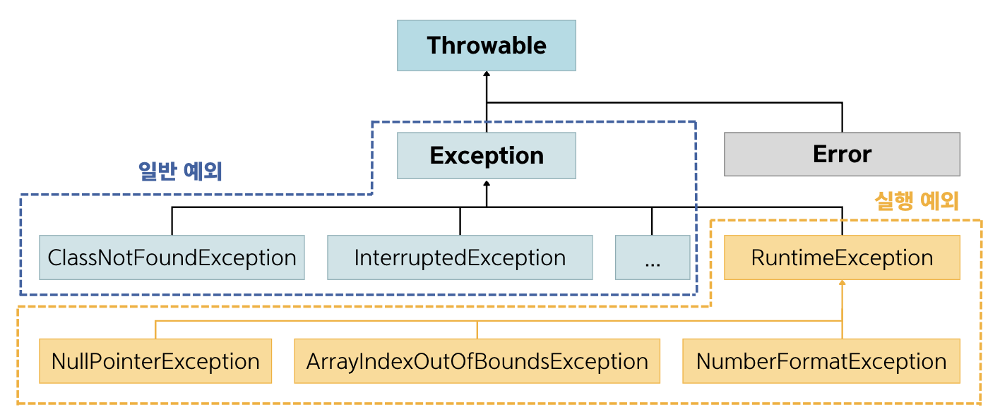

## 11.1 예외와 예외 클래스
- 💠`에러` : 컴퓨터 하드웨어의 고장으로 인해 응용프로그램 실행 오류가 발생하는 것 ➡️ 대처할 방법❌
- 💠`예외` : 잘못된 사용 또는 코딩으로 인한 오류 ➡️ 예외 처리를 통해 계속 실행 상태를 유지할 수 있음.

### 예외의 종류
- 1️⃣ 일반 예외(Exception) : 컴파일러가 예외 처리 코드 여부를 검사하는 예외
  - 실행 예외를 제외한 예외 클래스
- 2️⃣ 실행 예외(Runtime Exception) : 컴파일러가 예외 처리 코드 여부를 검사하지 않는 예외
  - RuntimeException과 그 자식 클래스

- 자바는 예외가 발생하면 예외 클래스로부터 객체를 생성하고, 이 객체는 예외 처리 시 사용됨.
- 자바의 모든 에러와 예외 클래스는 Throwable을 상속받아 만들어지고, 추가적으로 예외 클래스는 java.lang.Exception 클래스를 상속받음.
- 자바는 자주 사용되는 예외 클래스를 표준 라이브러리로 제공함.